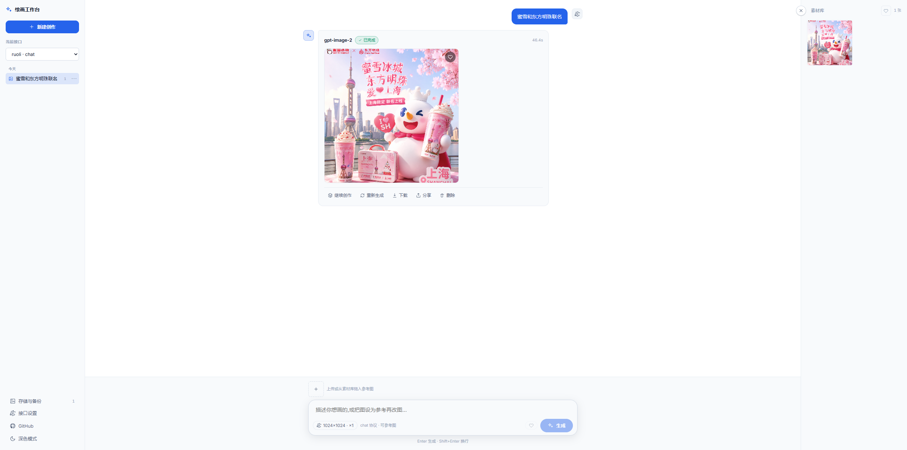
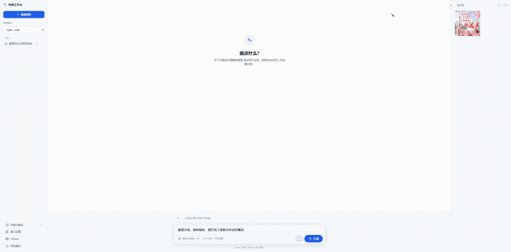

<div align="center">

# 🎨 AI Drawing Workbench

**A front-end-only, zero-backend AI drawing workbench — plug in your own OpenAI / NewAPI-compatible endpoint and start generating. All data stays in your browser.**

[中文](./README.md) · **English**

[](./LICENSE)
[](https://github.com/MY-Final/draw/stargazers)
[](https://vuejs.org/)
[](https://vitejs.dev/)

[**Live Demo**](https://120403.xyz/draw/) · [Quick Start](#quick-start) · [One-Click Deploy](#one-click-deploy)



</div>

---

A **front-end-only, zero-backend** AI drawing workbench. Plug in your own OpenAI / NewAPI-compatible endpoint and generate images right away. Everything — API keys, images, history — stays in your browser's local storage. Ship it as static hosting.

## Features

- **Zero backend**: the browser talks to the endpoint directly. No server, no account, no cloud sync.
- **Two protocols**: `images/generations` by default (pure text-to-image), switchable to `chat/completions` (supports reference images).
- **Reference images / iterative editing**: set any asset (including past results) as a reference and regenerate — multi-turn editing is just "reuse an old image as reference," with no conversation state.
- **Local asset library**: images are stored as Blobs in IndexedDB, never expiring by default; metadata and image bytes are separated, so one image can be reused in many places without duplicated storage.
- **Storage management**: view usage, delete assets; supports full-library zip export/import and backup reminders.
- **Backup & sharing** (all **exclude the API key**):
  - Full-library zip export / import (migrate across machines or browsers).
  - Endpoint preset sharing (the recipient fills in their own key after importing).
  - Single-generation "recipe" sharing (includes the reference image; the recipient reproduces it with their own endpoint).

## Demo

<div align="center">
  
</div>


## Quick Start

```bash
npm install
npm run dev      # local development
npm run build    # build static output to dist/
npm run preview  # preview the build
npm test         # run tests
```

First run: click **New** on the left to create an endpoint preset → fill in Base URL / API Key / Model / Protocol → **Test Connection** → Save → enter a prompt → Generate.

## Deployment

`npm run build` produces a `dist/` of pure static assets that can be hosted on any static server, object storage, GitHub Pages, etc. The build uses relative paths (`base: './'`), so it supports deployment under a sub-path.

### GitHub Pages (automatic)

The repo ships with `.github/workflows/deploy.yml`: every push to `main` builds and publishes automatically (or trigger it manually from the Actions tab). One manual step is required to enable it:

1. In the repo, go to **Settings → Pages → Build and deployment → Source** and choose **GitHub Actions**.
2. Push to `main` and wait for the Action to finish.
3. Visit <https://my-final.github.io/draw/> (the project is deployed under the `/draw/` sub-path; `base: './'` handles this, so assets won't 404).

> **Mixed-content note**: github.io is an https site, so the browser blocks requests to **http** endpoints from the page (mixed content). Make sure your endpoint Base URL is **https**; otherwise requests are silently blocked.

## One-Click Deploy

Click a button below to fork this repo to your GitHub account and deploy to the corresponding platform:

[](https://vercel.com/new/clone?repository-url=https://github.com/MY-Final/draw)
[](https://app.netlify.com/start/deploy?repository=https://github.com/MY-Final/draw)
[](https://deploy.workers.cloudflare.com/?url=https://github.com/MY-Final/draw)
[](https://github.com/MY-Final/draw/fork)

Every platform offers a free tier; after deploying you get your own public URL. Build settings are identical:

| Platform | Build command | Output dir | Notes |
|----------|---------------|------------|-------|
| Vercel | `npm run build` | `dist` | auto-detected after the button clones |
| Netlify | `npm run build` | `dist` | auto-detected after the button clones |
| Cloudflare Pages | `npm run build` | `dist` | choose the **Vite** framework preset |
| GitHub Pages | — | — | after forking, see [GitHub Pages (automatic)](#github-pages-automatic) above; published by the built-in Action |

## Known Constraints

- **CORS**: browsers direct-calling third-party endpoints are subject to the same-origin policy. "Supports any endpoint" assumes that endpoint **allows cross-origin** requests; endpoints that don't allow CORS can't be reached directly from a pure front end (error messages distinguish CORS/network, auth, and other cases).
- **Reference images require the chat protocol**: the `images/generations` protocol doesn't support reference images; when it's selected, the reference-image area is disabled with a hint.
- **Plaintext API key**: a pure front end has no secure hiding place, so the key is stored in plaintext in localStorage. Don't save it on a shared device; the UI provides a "clear credentials" button.
- **Browser storage**: IndexedDB may be evicted by the browser under storage pressure; export important assets via full-library zip backup.

## Tech Stack

Vue 3 + Vite · Pinia · idb (IndexedDB) · JSZip · pure-CSS design system (dark/light dual themes).

## Architecture Highlights

```
Data model : assets (image Blobs) and generations (generation events) are
             separated and reference each other by id.
Adapter    : a unified generate() interface isolates the two protocols; chat
             responses go through a robust image extractor for normalization.
Storage    : Blobs persisted to DB; display via URL.createObjectURL, released centrally.
Sharing    : all share-level exports are forced through stripKey() to strip the key
             (locked down by tests).
```

See `openspec/changes/archive/2026-07-11-bootstrap-drawing-workbench/` (proposal / design / specs / tasks) for details.

## License

[MIT](./LICENSE) © MY-Final

If this project helps you, please consider giving it a ⭐ Star.
