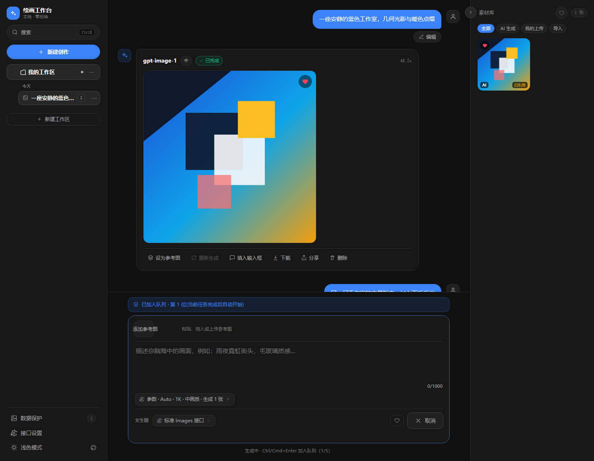
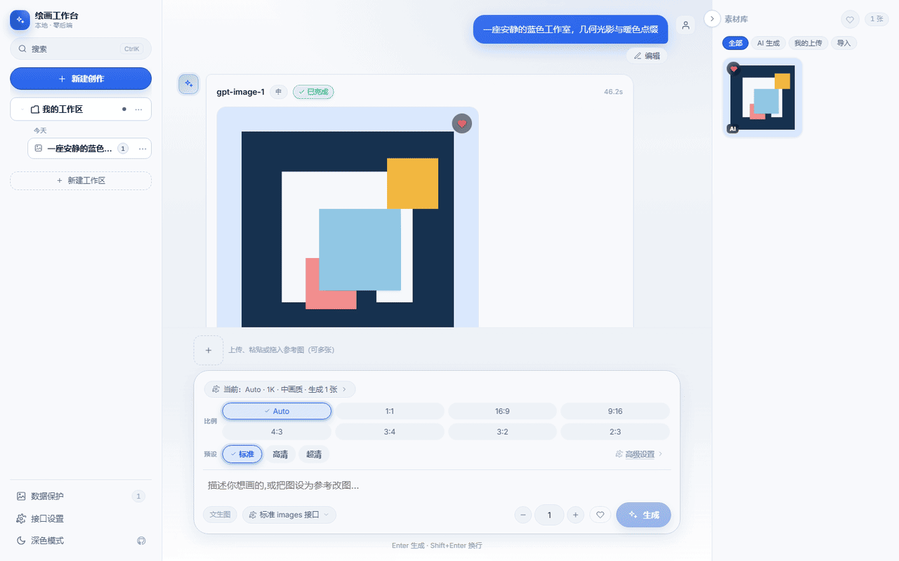
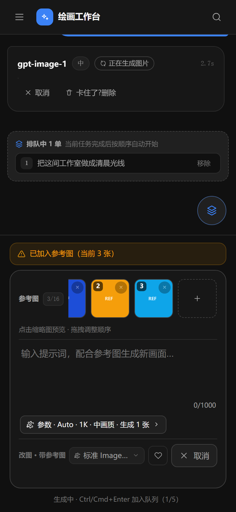

<div align="center">

# 🎨 AI Drawing Workbench

**A front-end-only, zero-backend AI drawing workbench — plug in your own OpenAI / NewAPI-compatible endpoint and start generating. All data stays in your browser.**

[中文](./README.md) · **English**

[](./LICENSE)
[](https://github.com/MY-Final/draw/stargazers)
[](https://vuejs.org/)
[](https://vitejs.dev/)
[](https://vitest.dev/)

[**Live Demo**](https://120403.xyz/draw/) · [Quick Start](#quick-start) · [One-Click Deploy](#one-click-deploy)



</div>

---

A **front-end-only, zero-backend** AI drawing workbench. Plug in your own OpenAI / NewAPI-compatible endpoint and generate images right away. Everything — API keys, images, history — stays in your browser's local storage. Ship it as static hosting.

## Features

- **Zero backend**: the browser talks to the endpoint directly. No server, no account, no cloud sync.
- **Standard images protocol**: text-to-image via `images/generations`; with reference images it automatically uses `images/edits` (OpenAI-compatible). Legacy `chat` / `auto` presets are migrated to `images` automatically.
- **Reference images / iterative editing**: set one or more assets (including past results) as references and regenerate (up to 16 per request, all sent together) — multi-turn editing is just "reuse an old image as reference," with no conversation state. Missing references produce a clear error instead of silently falling back to text-to-image. Thumbnails can be reordered by drag, or by focusing one and using `←` `→` `Home` `End` (the move is announced to screen readers).
- **Generation queue**: an image endpoint handles one request at a time, so an idle app generates immediately; submitting again while a job is running (press `Ctrl/⌘ + Enter` while the button shows Cancel) joins a queue of up to 5 jobs. Queued items can be promoted or removed, and the queue then runs automatically in order. Every queued item remembers the workspace and conversation it came from, so switching context never files the result in the wrong place.
- **Editable messages**: edit a prompt after generation and regenerate with the new text while keeping the original params and references; the message history updates in place.
- **Undoable deletion**: deleting a single generation, a batch of assets, a conversation, or a workspace all get a 5-second undo window with a consistent toast (hosted at app level, so it survives closing the mobile drawer). During the window the item is only hidden in the UI — the data is still on disk, and reloading the page simply cancels the deletion. Assets still referenced by generation history stay blocked, with the reason shown.
- **Large preview**: open any result or asset to zoom with the wheel, toggle zoom by double click, pan while zoomed, copy the prompt, or copy the image to the clipboard.
- **Distinguishable asset sources**: filter the library by "AI generated / my uploads / imported" with per-cell source badges, so large libraries stay organized.
- **Batch count verification**: if N images were requested but the endpoint returned only M, the result card shows an explicit warning with the raw response snippet instead of silently dropping images.
- **Local asset library**: images are stored as Blobs in IndexedDB, never expiring by default; metadata and image bytes are separated, so one image can be reused in many places without duplicated storage. Assets still referenced by generation history cannot be deleted directly.
- **Long-running generation support**: each endpoint has a configurable 30–1800 second request timeout (180 seconds by default); user cancellation and timeout are recorded separately. Interrupted jobs are reconciled after a page reload, and URL-based result downloads retain a 60-second safety timeout.
- **Workspaces and mobile**: workspaces, conversation history, unified search (`Ctrl/⌘ K`, with thumbnails in the results; picking a hit switches to its workspace first), mobile navigation, and a mobile asset-library entry point. On mobile the reference images become a single horizontally scrolling row, so the composer no longer grows with every image.
- **Saved prompt library**: keep frequently used prompts per workspace, with search and in-place editing (duplicates are rejected).
- **Keyboard shortcuts**: `/` focuses the prompt box, `Alt + N` starts a new conversation, `Ctrl/⌘ + K` opens search, `Ctrl/⌘ + Enter` generates (or queues while busy). The empty state offers clickable inspiration chips that prefill the prompt.
- **Storage management**: view usage and delete assets; full-library zip import reports progress and merges instead of wiping (same IDs overwrite, existing API keys kept), plus backup reminders.
- **Backup & sharing** (all **exclude the API key**):
  - Full-library zip export / import (migrate across machines or browsers).
  - Endpoint preset sharing (the recipient fills in their own key after importing).
  - Single-generation "recipe" sharing (includes the reference image; the recipient reproduces it with their own endpoint).

## Demo

<div align="center">
  
  <br><br>
  
</div>


## Quick Start

```bash
npm install
npm run dev      # local development
npm run build    # build static output to dist/
npm run preview  # preview the build
npm test         # run tests
```

First run: click **Add endpoint** → fill in Base URL / API Key / Model → **Test Connection** → Save → enter a prompt → Generate. If you are out of ideas, click an inspiration chip in the empty state to prefill a prompt first.

### Keyboard shortcuts

| Shortcut | Action |
|----------|--------|
| `Ctrl/⌘ + Enter` | Generate; while busy it queues the draft instead (up to 5 jobs) |
| `Enter` | Newline inside the prompt box |
| `Ctrl/⌘ + K` | Open unified search |
| `/` | Focus the prompt box (typing `/` inside a field is unaffected) |
| `Alt + N` | Start a new conversation |
| `Esc` | Close overlays / cancel editing (dirty edits ask first) |
| `←` `→` `Home` `End` | Reorder reference thumbnails while one is focused |
| `+` `-` `0` | Zoom / reset the large preview (wheel and double click also work) |

> **Long-running requests**: each endpoint waits 180 seconds by default and can be configured from 30 to 1800 seconds. Timeouts become failed results, explicit cancellation remains distinct, and reloading marks the in-flight job as interrupted.
>
> **Queue note**: generation is single-flight — one request at a time, everything else waits in a queue of up to 5 jobs. The queue lives in page memory only, so a reload drops whatever has not started yet.

## Deployment

`npm run build` produces a `dist/` of pure static assets that can be hosted on any static server, object storage, GitHub Pages, etc. The build uses relative paths (`base: './'`), so it supports deployment under a sub-path.

### GitHub Pages (automatic)

The repo ships with `.github/workflows/deploy.yml`: every push to `main` builds and publishes automatically (or trigger it manually from the Actions tab). One manual step is required to enable it:

1. In the repo, go to **Settings → Pages → Build and deployment → Source** and choose **GitHub Actions**.
2. Push to `main` and wait for the Action to finish.
3. Visit <https://my-final.github.io/draw/> (the project is deployed under the `/draw/` sub-path; `base: './'` handles this, so assets won't 404).

> **Mixed-content note**: github.io is an https site, so the browser blocks requests to **http** endpoints from the page (mixed content). Make sure your endpoint Base URL is **https**; otherwise requests are silently blocked.

## One-Click Deploy

Click a button below to fork this repo to your GitHub account and deploy to the corresponding platform:

[](https://vercel.com/new/clone?repository-url=https://github.com/MY-Final/draw)
[](https://app.netlify.com/start/deploy?repository=https://github.com/MY-Final/draw)
[](https://deploy.workers.cloudflare.com/?url=https://github.com/MY-Final/draw)
[](https://github.com/MY-Final/draw/fork)

Every platform offers a free tier; after deploying you get your own public URL. Build settings are identical:

| Platform | Build command | Output dir | Notes |
|----------|---------------|------------|-------|
| Vercel | `npm run build` | `dist` | auto-detected after the button clones |
| Netlify | `npm run build` | `dist` | auto-detected after the button clones |
| Cloudflare Pages | `npm run build` | `dist` | choose the **Vite** framework preset |
| GitHub Pages | — | — | after forking, see [GitHub Pages (automatic)](#github-pages-automatic) above; published by the built-in Action |

## Known Constraints

- **CORS**: browsers direct-calling third-party endpoints are subject to the same-origin policy. "Supports any endpoint" assumes that endpoint **allows cross-origin** requests; endpoints that don't allow CORS can't be reached directly from a pure front end (error messages distinguish CORS/network, auth, and other cases).
- **Connectivity probe**: "Test connection" only does `GET /v1/models` and never triggers a billable image generation.
- **Generation requests**: image-generation API calls use the endpoint preset timeout and preserve truncated server details on failure. If the API returns an external image URL, the subsequent download step has a 60-second safety timeout.
- **Single-flight generation**: one request at a time, with everything else queued in memory (up to 5 jobs); the queue does not survive a page reload.
- **Deletion is deferred**: conversations, workspaces, assets, and single generations keep a 5-second undo window. The data is still in the database during that window, so reloading the page simply cancels the deletion and the content is still there.
- **Plaintext API key**: a pure front end has no secure hiding place, so the key is stored in plaintext in localStorage. Don't save it on a shared device; the UI provides a "clear credentials" button.
- **Browser storage**: IndexedDB may be evicted by the browser under storage pressure; export important assets via full-library zip backup.

## Tech Stack

**Frontend**: Vue 3 (Composition API + `<script setup>`) with Pinia state management · Vite build · standard OpenAI images adapter layer (`generations` / `edits` auto-routing).

**Storage**: idb (IndexedDB) stores image Blobs and generation records with metadata kept separate from image bytes, so one image can be reused without duplication; localStorage holds lightweight preferences (presets, theme, conversation titles).

**Testing**: Vitest unit tests (with fake-indexeddb) cover the generation pipeline, queue scheduling, undoable deletion, reference-aware deletion, share sanitization, the prompt library, and workspaces; Playwright smoke tests run on desktop (1440×900) and mobile (390×844), covering initialization, workspace switching, the queue and cancelling, keyboard reordering of reference images, import feedback, dialog focus handling, and mobile layout.

```bash
npm test                          # unit tests
npm run test:e2e -- --workers=1   # end-to-end tests (starts the dev server)
```

**Styling**: a pure-CSS design system (design tokens, dark/light dual themes) with no UI framework; icons are inline SVGs (Lucide-style).

**Utilities**: JSZip for full-library zip backup / restore.

## Architecture Highlights

```
Data model : assets (image Blobs) and generations (generation events) are
             separated and reference each other by id.
Adapter    : unified generate(); no refs → generations, with refs → edits; generation calls use the endpoint timeout.
Scheduling : single-flight generation plus an in-memory queue (max 5); each queued
             item remembers the workspaceId / conversationId it came from.
Lifecycle  : explicit user cancellation; stale pending jobs reconciled after reload; active jobs and orphan outputs cleaned up on deletion.
Deletion   : generations, assets, conversations and workspaces share one
             "defer the write + 5-second undo" path; during the window items are
             hidden in memory only and the database stays the source of truth.
Storage    : Blobs persisted to DB; display via URL.createObjectURL, released centrally; reference-aware deletion protects history.
Sharing    : all share-level exports are forced through stripKey() to strip the key
             (locked down by tests).
```

See `openspec/changes/archive/2026-07-11-bootstrap-drawing-workbench/` (proposal / design / specs / tasks) for details.

## License

[MIT](./LICENSE) © MY-Final

If this project helps you, please consider giving it a ⭐ Star.
